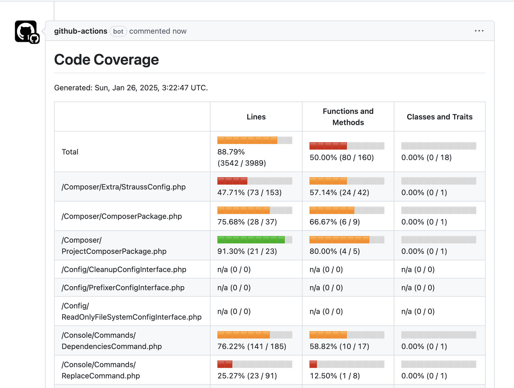

[](https://php.net)

# PHP Coverage Filter

* Run only the tests that cover lines that have been changed.
* View the report for only files that have been changed. 
* Generate code coverage report in markdown.

Goals:

* ✅ Speed up TDD by only running the tests that cover the code you're working on.
* ✅ GitHub Actions workflow to print the code coverage report for the changed files in a pull request.

## Install

Via Phive:

```
phive install brianhenryie/php-diff-test
```

Or via Composer:

```
composer require --dev brianhenryie/php-diff-test
```

## Run

Requires `XDEBUG_MODE=coverage`.

### `php-diff-test filter` 

Prints a filter to use with PHPUnit or Codeception, so you only run tests relevant to changes in the branch you're working on.

* Run: `phpunit --filter="$(php-diff-test filter)"` or `codecept run suitename "$(php-diff-test filter)"`.
* Try just `php-diff-test filter` to see the filter that will be applied, which is effectively `php-diff-test filter --input-files <glob *.cov> --diff-from main --diff-to HEAD~0 --granularity line`
* Try `php-diff-test filter --diff-from HEAD~3` to print a shallower filter
* Try `php-diff-test filter --granularity file` to print a filter which includes all tests that cover any line in changed files (this makes the HTML report make more sense)

### `php-diff-test coverage`

Outputs a new `.cov` file containing only the files whose lines have been changed in the diff. Intended to then print a HTML coverage report

* Run: `php-diff-test coverage --input-files "php-coverage1.cov,php-coverage2.cov" --diff-from main --diff-to HEAD~0 --output-file diff-coverage/diff-from-to.cov`
* Then to generate the new HTML report: `phpcov merge ./diff-coverage --html ./diff-coverage/report`. NB `phpcov` will merge all `.cov` files in the directory and subdirectories so you should set `php-diff-test coverage`'s new `.cov` `--output-file` to be in its own directory.

## How it works

Runs `git diff`, parses which lines have been changed, parses `*.cov` codecoverage files to match which tests cover those lines.

The script looks in the current working directory, its `tests` subfolder, and each of the `tests` immediate subfolders for `*.cov`.

It also checks `tests` for Codeception `*.suite.y*ml` files, and assumes a file named `unit.cov` corresponds with `unit.suite.yml` to determine should the output be formatted for `codecept run...` syntax rather than PHPUnit `--filter="..."` syntax.

Obviously, it's assumed you're working inside a Git repo and have previously generated code coverage (in PHP `.cov` format).

> ⚠️ This has been tested to just over 500 test cases. It will inevitably have its limits, when you should probably use [groups](https://docs.phpunit.de/en/10.5/annotations.html#group) to first generate the coverage to be filtered.

## Composer Scripts

Rough notes

```json
{
  "scripts": {
    "post-install-cmd": [
      "@install-phive-dependencies"
    ],
    "post-update-cmd": [
      "@install-phive-dependencies"
    ],
    "install-phive-dependencies": [
      "if [ -z \"$(command -v phive)\" ]; then echo \"Phive is not installed. Run 'brew install gpg phive' or see https://phar.io/.\"; exit 1; fi;",
      "phive install"
    ],
    "test-changes": [
      "if [ -z \"$(command -v ./tools/php-diff-test)\" ]; then echo \"Please install 'php-diff-test' with 'phive install'.\"; exit 1; fi;",
      "if [ \"$XDEBUG_MODE\" != \"coverage\" ]; then echo 'Run with XDEBUG_MODE=coverage composer test-changes'; exit 1; fi;",
      "phpunit --filter=\"$(./tools/php-diff-test filter --input-files tests/_reports/php.cov --granularity=line)\" --coverage-text;"
    ],
    "test-changes-report": [
      "if [ -z \"$(command -v ./tools/php-diff-test)\" ]; then echo \"Please install 'php-diff-test' with 'phive install'.\"; exit 1; fi;",
      "if [ -z \"$(command -v ./tools/phpcov)\" ]; then echo \"Please install 'phpcov' with 'phive install'.\"; exit 1; fi;",
      "if [ \"$XDEBUG_MODE\" != \"coverage\" ]; then echo 'Run with XDEBUG_MODE=coverage composer test-changes-report'; exit 1; fi;",
      "if [ -d \"tests/_reports/diff\" ]; then rm -rf tests/_reports/diff; fi;",
      "phpunit --filter=\"$(./tools/php-diff-test filter --input-files tests/_reports/php.cov --granularity file)\" --coverage-text --coverage-php tests/_reports/diff/php.cov -d memory_limit=-1;",
      "./tools/php-diff-test coverage --input-files tests/_reports/diff/php.cov --output-file tests/_reports/diff/php.cov;",
      "./tools/phpcov merge tests/_reports/diff --html tests/_reports/diff/html;",
      "open tests/_reports/diff/html/index.html"
    ],
    "test-coverage": [
      "Composer\\Config::disableProcessTimeout",
      "if [ \"$XDEBUG_MODE\" != \"coverage\" ]; then echo \"Run with 'XDEBUG_MODE=coverage composer test-coverage'\"; exit 1; fi;",
      "phpunit --coverage-text --coverage-html tests/_reports/html --coverage-clover tests/_reports/clover.xml --coverage-php tests/_reports/php.cov -d memory_limit=-1 --order-by=random",
      "php-coverage-badger tests/_reports/clover.xml .github/coverage.svg",
      "if [ $(command -v ./tools/phpcov) ]; then git diff main...head > /tmp/main.diff; ./tools/phpcov patch-coverage --path-prefix $(pwd) ./tests/_reports/php.cov /tmp/main.diff || true; fi;",
      "# Run 'open ./tests/_reports/html/index.html' to view report."
    ]
  },
  "scripts-descriptions": {
    "test-changes": "Run PHPUnit only on lines that have changed in main...HEAD",
    "test-changes-report": "Run PHPUnit only on files that have changed in main...HEAD and display the HTML report.",
    "test-coverage": "Run PHPUnit tests with coverage. Use 'XDEBUG_MODE=coverage composer test-coverage' to run, 'open ./tests/_reports/html/index.html' to view."
  }
}
```

## GitHub Actions

[](https://github.com/BrianHenryIE/strauss/pull/139#issuecomment-2614192979) 

Rough notes:

```yaml
name: Code Coverage

# Runs PHPUnit with code coverage enabled, commits the html report to
# GitHub Pages, generates a README badge with the coverage percentage.
#
# Requires a gh-pages branch already created.
#
#  git checkout --orphan gh-pages
#  touch index.html
#  git add index.html
#  git commit -m 'Set up gh-pages branch' index.html
#  git push origin gh-pages
#
# @author BrianHenryIE

on:
  push:
    branches:
      - master
    paths:
      - '**.php'
  pull_request:
    types: [ opened, reopened, ready_for_review, synchronize ]
  workflow_dispatch:

jobs:
  tests:
    runs-on: ubuntu-latest

    permissions:
      pull-requests: write # For mshick/add-pr-comment

    strategy:
      matrix:
        php-version: ['8.2']

    steps:

      - name: Checkout repository
        uses: actions/checkout@v4
        with:
          fetch-depth: 0 # Fetch all history for git diff.

      - name: Install PHP
        uses: shivammathur/setup-php@v2
        with:
          php-version: ${{ matrix.php-version }}
          tools: composer:v2, phive
          coverage: xdebug

      - name: Install Phive tools
        uses: ngmy/phive-install-action@master # Running Phive install requires console input, this takes care of that.

      - name: Checkout GitHub Pages branch for code coverage report
        uses: actions/checkout@v4
        with:
          ref: gh-pages
          path: tests/_reports/html

      - name: Install dependencies
        run: composer update

      - name: Clear previous code coverage
        working-directory: tests/_reports/html
        run: |
          rm -rf *

      - name: Execute tests with full code coverage report
        run: XDEBUG_MODE=coverage composer run-script test-coverage
#        run: XDEBUG_MODE=coverage vendor/bin/phpunit --filter="unit|integration" --coverage-html tests/_reports/html --coverage-clover tests/_reports/clover.xml --coverage-php tests/_reports/php.cov -d memory_limit=-1 --order-by=random
        
      - name: Generate diff coverage report
        if: ${{ matrix.php-version == '8.2' && github.event_name == 'pull_request' }}
        run: |
          # Determine the commit that the branch was created from.
          BRANCHED_COMMIT=$(git rev-list $(git rev-parse HEAD) ^origin/master | tail -n 1)
          # Filter the code coverage report to only include the files that have changed.
          ./tools/php-diff-test coverage --input-files "tests/_reports/php.cov" --diff-from $BRANCHED_COMMIT --diff-to ${{ github.event.pull_request.head.sha }} --output-file tests/_reports/branch/branch.cov
          # Generate the HTML report for the filtered code coverage report.
          ./tools/phpcov merge tests/_reports/branch/ --html tests/_reports/diff/html

      - name: Generate code coverage markdown report
        if: ${{ matrix.php-version == '8.2' && github.event_name == 'pull_request' }}
        run: |
          ./tools/php-diff-test markdown-report --input-file "./tests/_reports/branch/branch.cov" --output-file code-coverage.md

      - name: Add code coverage comment/reply to PR
        uses: mshick/add-pr-comment@v2
        if: ${{ matrix.php-version == '8.2' && github.event_name == 'pull_request' }}
        with:
          message-path: |
            code-coverage.md

      - name: Add code coverage output to gh-pages
        working-directory: tests/_reports/html
        run: |
          touch .nojekyll
          git add -- .nojekyll *

      - name: Commit code coverage to gh-pages
        if: ${{ github.ref == 'refs/heads/master' && matrix.php-version == '8.2' }} # only commit on master, once
        uses: stefanzweifel/git-auto-commit-action@v5
        with:
          repository: tests/_reports/html
          branch: gh-pages
          commit_message: "🤖 Update code coverage to gh-pages"
          commit_options: ""
        env:
          GITHUB_TOKEN: "${{ github.token }}"

      - name: Update README badge
        run: vendor/bin/php-coverage-badger tests/_reports/clover.xml .github/coverage.svg

      - name: Commit code coverage badge
        if: ${{ github.ref == 'refs/heads/master' && matrix.php-version == '8.2' }} # only commit on master, once
        uses: stefanzweifel/git-auto-commit-action@v5
        with:
          commit_message: "🤖 Update code coverage badge" # TODO: Add percentage to commit message
        env:
          GITHUB_TOKEN: ${{ secrets.DEPLOY_KEY }} # Required when master branch is protected.
```

## TODO

* ~~I think the diff doesn't track unstaged/uncommitted files which could have code coverage~~
* Also run tests changed in the diff / run all tests changed since the code coverage was generated (i.e. Tests written after the code coverage report are not included in the filter)
* Figure how best merge/increment coverage reports – i.e. once `php-diff-test coverage` has been run on the full coverage report, add to it when new tests are written
* ~~Allow specifying a hash to diff with – i.e. make pull requests run faster~~
* https://github.com/sebastianbergmann/php-code-coverage/issues/571 – code coverage annotations make this tool less thorough 
* ~~Tidy up the code – I'm not sure is the diff report's lines the current lines or the before lines... use both for best effect~~
* Tests!
* Should this be implemented as a PHPUnit extension?

## See Also

* https://github.com/robiningelbrecht/phpunit-coverage-tools
* https://docs.phpunit.de/en/10.5/extending-phpunit.html
* https://localheinz.com/articles/2023/02/14/extending-phpunit-with-its-new-event-system/
